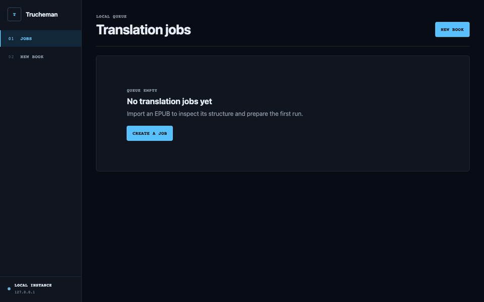

<p align="center">
  
</p>

<h1 align="center">Trucheman</h1>

<p align="center">
  <strong>Translate books, not just strings.</strong><br>
  A local-first EPUB translation studio with literary editing, consistency control,<br>
  resumable jobs, and validated output.
</p>

<p align="center">
  <a href="https://github.com/ferruman/Trucheman/actions/workflows/ci.yml"></a>
  <a href="https://github.com/ferruman/Trucheman/actions/workflows/container.yml"></a>
  <a href="LICENSE"></a>
  
  
</p>

> [!IMPORTANT]
> Trucheman is pre-1.0 and under active development. Keep backups of source books and local job
> data when upgrading.

## See it in action

<p align="center">
  
</p>

The demo uses the deterministic local provider: no API key, network request, or staged mockup. It
runs the same import, translation, editing, build, validation, and reporting flow used by a live
provider.

## Why Trucheman?

|                         |                                                                                                      |
| ----------------------- | ---------------------------------------------------------------------------------------------------- |
| **EPUB-aware**          | Preserves book structure and formatting instead of treating an EPUB as one giant text file.          |
| **Literary pipeline**   | Separates translation, editing, consistency, optional critique, and targeted repair.                 |
| **Local-first**         | Keeps source books, checkpoints, reports, and generated EPUBs on your machine.                       |
| **Safe to interrupt**   | Resumes durable jobs without paying for completed provider calls twice.                              |
| **Standard or Batch**   | Runs immediately through Chat Completions or asynchronously through the OpenAI Batch API.            |
| **Validated output**    | Checks archive safety, rebuilt structure, untranslated fragments, consistency, and EPUB conformance. |
| **Visible model usage** | Reports request and token totals for every pipeline stage and exact model.                           |

## Quick start

You need Docker Desktop or Docker Engine with the Compose plugin.

```sh
git clone https://github.com/ferruman/Trucheman.git
cd Trucheman
cp .env.example .env
docker compose up -d
```

Open [http://127.0.0.1:4173](http://127.0.0.1:4173). Without provider credentials, Trucheman uses
its deterministic local provider, so you can safely explore the complete workflow first.

For live translation, add your provider keys and models to `.env`, then restart:

```sh
docker compose restart
```

Job data survives container replacement in the `trucheman-data` volume. Keys are mounted through
Docker Compose secrets, the service runs as a non-root user, and the port is exposed only on the
loopback interface.

```sh
docker compose logs -f                 # follow startup and jobs
docker compose pull && docker compose up -d  # update
docker compose down                    # stop without deleting books
```

Do not run `docker compose down -v` unless you intend to delete all local Trucheman data. The
[Docker guide](docs/docker.md) covers installation, updates, backup, and restore.

## The pipeline

```text
Import → Inspect → Translate → Literary edit → Consistency → Build → Validate
                               ↘ Critic → selective repair ↗
```

- **Standard quality** translates, edits, and applies book-wide consistency decisions.
- **High quality** additionally audits every edited segment and repairs only validated medium- or
  high-severity findings.
- **Standard processing** starts provider requests immediately.
- **Batch processing** submits durable asynchronous work to the official OpenAI Batch API, which
  can reduce provider cost at the expense of latency.

Pausing or restarting Trucheman preserves completed checkpoints and submitted batch identifiers.
Changing a quality mode keeps reusable work whenever the pipeline boundary allows it.

<details>
<summary><strong>Provider configuration</strong></summary>

Translation, literary editing, critique, and consistency can use independently configured
OpenAI-compatible profiles. A minimal DeepSeek configuration looks like this:

```dotenv
TRUCHEMAN_TRANSLATION_API_KEY=your-key
TRUCHEMAN_EDITING_API_KEY=your-key
TRUCHEMAN_TRANSLATION_MODEL=deepseek-v4-flash
TRUCHEMAN_EDITING_MODEL=deepseek-v4-flash
TRUCHEMAN_CRITIC_MODEL=deepseek-v4-flash
TRUCHEMAN_CONSISTENCY_MODEL=deepseek-v4-flash
```

Omitted critic settings inherit the editing profile. Omitted consistency settings inherit the
translation profile. Restart the service after editing `.env`.

Batch mode requires the official `https://api.openai.com/v1/chat/completions` endpoint for every
configured profile and compatible OpenAI models. Trucheman rejects other endpoints before
uploading book text.

</details>

## Privacy and boundaries

Trucheman is a single-user local application. It stores books and job state locally, but a live
provider run sends eligible book text to the APIs you configure. It does not provide authentication
and must not be exposed directly to the public internet.

Use only DRM-free books you have the right to process. Never commit `.env`, source books, or local
job data. Report vulnerabilities privately according to [SECURITY.md](SECURITY.md).

## Development

Requirements: Node.js 24 or newer.

```sh
npm install
npm run typecheck
npm test
npm run build
npm run dev
```

The development server listens on `127.0.0.1:4173`. Copy `.env.example` to `.env.local` for local
provider credentials; `.env.local` takes precedence over `.env`.

## Project docs

- [Product overview](PRODUCT.md)
- [Architecture](ARCHITECTURE.md)
- [Docker operations](docs/docker.md)
- [Contributing](CONTRIBUTING.md)
- [Security policy](SECURITY.md)
- [Support](SUPPORT.md)

## License

Trucheman is available under the [MIT License](LICENSE).
